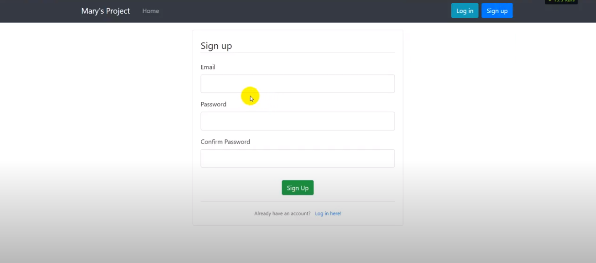
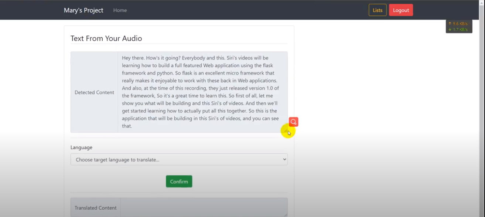

# Cloud Computing Project

[TOC]

## **Description:**

- The core functions of the web application is to obtain text content inside the 
most common media files(images and audios) and translate it to other languages.

- Not only neat printing text can be detected, the system can also give detect text 
from handwriting and irregular printing layout.

- All the transcription requests by user will be stored, user can check the content
multiple times without uploading the audio files again.

- The translated content of transcription result will generate a file, and the 
download link will be sent to user's mailbox. (Note: the user has to confirm 
subscription first.)

---

> **Public link:**
> ~~http://project-env.eba-zysihajv.us-east-1.elasticbeanstalk.com/~~
>
> > (URL is expired because the credits of my education account has been used up)
> > (will upload a video online for the website and give an URL)

---

## Software Architecture

---

## Use Case Examples: 

#### 1. Handwriting recognition + translation

​	choose "image" -> choose language -> upload image -> **get result !** 

#### 2. Irregular printing (cosmetics/logos)

​	choose "image" -> choose language -> upload image -> **get result !** 

#### 3. Video transcription

​	choose "video" -> login/sign up ( -> if sign up, then could confirm subscription) -> upload video -> wait until job completed -> if completed, then click to see transcription 

#### 

#### 4. Transcription job tracking

 click "login" -> click "lists" -> choose completed job to see transcription

#### 5. Notification received in mailbox

​	in completed transcription page -> choose language -> click "confirm" -> receive email in mailbox

#### 6. Download translated file

​	in email with download link -> click on download link -> choose a position to save locally -> open txt file with any editor

---

## Screenshots

#### main page

> 

#### login/signup (to use transcription feature)

> 

> 

> ##### 	validation
>
> > 

#### image page

> 

> 

#### video page (create job)

> 

#### job list

> 

#### job detail

> 